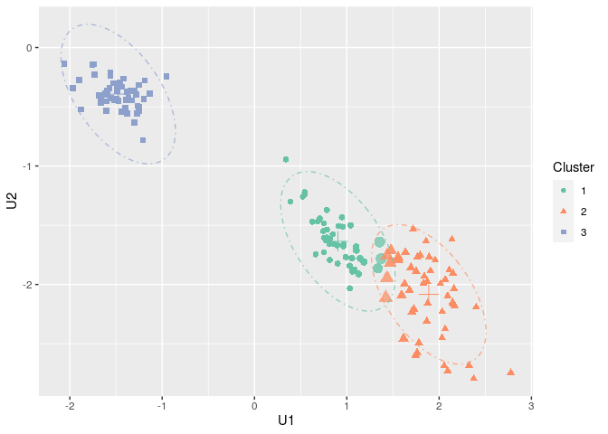

<!-- badges: start -->

[](https://travis-ci.com/nicolasJouvin/FisherEM)
<!-- badges: end -->

> New version of the FisherEM package with the Bayesian Fisher EM
> implemented.

## Installation

### R Package installation

#### CRAN dependencies

**FisherEM** needs the following CRAN R packages, so check that they are
are installed on your computer.

``` r
required_CRAN <- c("MASS", "elasticnet", "parallel", "ggplot2")
not_installed_CRAN <- setdiff(required_CRAN, rownames(installed.packages()))
if (length(not_installed_CRAN) > 0) install.packages(not_installed_CRAN)
```

#### Installing FisherEM

  - A planned submission on CRAN in October

<!-- # ```{r package CRAN, eval = FALSE} -->

<!-- # install.packages("FisherEM") -->

<!-- # ``` -->

  - For the development version, use the github install

<!-- end list -->

``` r
remotes::install_github("nicolasJouvin/FisherEM")
```

<!-- - For a specific tagged release, use -->

<!-- ```{r package tag, eval = FALSE} -->

<!-- remotes::install_github("nicolasJouvin/FisherEM@tag_number") -->

<!-- ``` -->

## New features

#### Simulation function

We added the script to simulate and reproduce of the BFEM chapter, 3
simulations are available.

``` r
# Chang 1983 setting
n = 300
simu = simu_bfem(n, which = "Chang1983")

# Section 4.2: 
p = 50
noise = 1
simu = simu_bfem(n = n, which = "section4.2", p = p, noise = noise)

# Section 4.3: 
snr = 3
simu = simu_bfem(n=n, which = "section4.2", snr)
```

#### The Bayesian Fisher-EM algorithm

The function structure, arguments and output are similar to `fem()`and
`sfem()`.

``` r
Y = iris[,-5]
cl_true = iris[,5]
res.bfem = bfem(Y, K = 3, model="DB", init = 'kmeans', method = 'gs', nstart = 10)

print(fem.ari(res.bfem, cl_true))
## [1] 0.9602777
```

#### Visualisation

``` r
ggbound = plot(res.bfem, type = 'elbo')
ggbound
```

<!-- -->

``` r
ggspace = plot(res.bfem, type = 'subspace')
ggspace
```

<!-- -->
